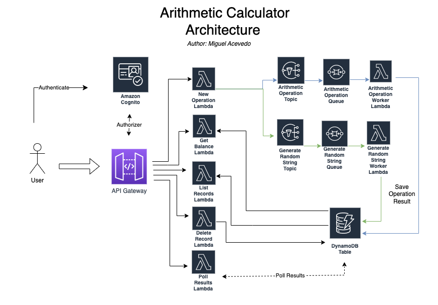

<!--
title: 'Arithmetic Calculator Backend API'
description: 'This project is a simple calculator that allows users to perform basic mathematical operations (addition, subtraction, multiplication, division) and generate a random string.'
layout: Doc
framework: v3
platform: AWS
language: python
authorLink: 'https://github.com/miguelalb'
authorName: 'Miguel Acevedo'
authorAvatar: 'https://github.com/miguelalb.png'
-->


# Arithmetic Calculator REST API

This project is a simple calculator that allows users to perform basic mathematical operations (addition, subtraction, multiplication, division) and also generate a random string.
Each one of these operations have a separate cost per request; users have an initial credit/balance and each request updates their balance accordingly.  
This Repo contains the code for the **backend**, you can find the [frontend source code here](https://github.com/miguelalb/arithmetic-calculator-frontend).
### Tech Stack
I built this project using Vue.js on the frontend and AWS serverless services on the backend, including AWS Lambda, DynamoDB, SNS, and SQS.   
All these resources are defined as infrastructure-as-code on the Serverless framework and using CloudFormation template code to define resources.   
The backend is decoupled and uses a [pub/sub](https://aws.amazon.com/pub-sub-messaging/) model to perform operations asynchronously, and a [Fanout](https://docs.aws.amazon.com/sns/latest/dg/sns-common-scenarios.html) architecture that allows for parallel asynchronous processing.   
Additionally, the client-side includes an exponential backoff retry mechanism using Axios with the `axios-retry` library, to ensure reliable polling for the operation results.  

### Architecture/Data Flow Overview    

1. User sends a request to the API Gateway endpoint to perform a mathematical operation, providing their access token and the necessary operation details.
2. The request is authenticated and authorized by AWS Cognito user pools, ensuring that the user has the necessary permissions to perform the requested operation.
3. The API Gateway endpoint forwards the request to a Lambda function that checks if the user's balance can cover the operation costs and publishes a message to an SNS topic if so.
4. The SNS topic fans out the message to an SQS queue that is subscribed by a worker Lambda function that performs the mathematical operation.
5. The worker Lambda function saves the operation result to a DynamoDB table with a unique identifier.
6. The client can then poll a REST API endpoint with the unique identifier to retrieve the operation result from the DynamoDB table.
7. The Vue.js client uses the Axios library with axios-retry to handle API requests and retries, providing a smooth and robust user experience.  

Overall, this architecture separates the calculation logic from the user request and response handling, making the system more decoupled and scalable. The use of AWS services such as Cognito, SNS, SQS, Lambda, and DynamoDB provides a highly available and scalable solution with minimal infrastructure management.

### Why I Chose these Technologies
The decision to use a decoupled architecture with AWS Lambda, API Gateway, SNS and SQS may seem a little complex, and maybe an overkill for this small project, but it allows me to achieve a **highly scalable, fault-tolerant, and resilient system** that can handle a high volume of requests just like any production system out there.  

- By using a pub/sub and Fanout model, I ensure that my system is maintainable, separated by components that can scale independently of each other, and make it easier to add additional components/functionality in the future.
  *For example, I may have a use case where I want to track transactions that users make as 'events' for data analytics/marketing purposes. I can accomplish this without affecting any current code and without putting any additional load on the Database. Just craft a new service, subscribe it to the topics of interest, and send the events to any marketing system of my choice*.

- With the use of serverless technology I eliminate the need for infrastructure management and get automatic scaling out of the box.  

- Vue.js as the front-end technology it's simple, easy to use and very responsive.  

- By using AWS Cognito user pools for authentication and authorization, I ensure a secure and reliable authentication mechanism that I don't have to manage myself. It also provides me with many features I could use in the future such as Social Sign-on, allowing me to focus on the business logic that generates the most value for the application.  
- The hosted UI that comes with Cognito makes it easy for me to implement a user authentication flow without the need for building a custom solution from scratch.  

Overall, I think the combination of these technologies provides a highly scalable, maintainable, and secure system that can handle a large volume of requests while keeping development time and operation cost low.

### DynamoDB Single Table Design  
I went with a single table design approach as [recommended by AWS](https://aws.amazon.com/blogs/database/single-table-vs-multi-table-design-in-amazon-dynamodb/).
#### Why single table design?
I chose to use a single table design for DynamoDB because it provides cost $ and performance benefits. DynamoDB partitions data across multiple servers for scalability, and a single table design allows related data to be grouped together (by the partition key) for more efficient querying and indexing.   

This reduces the need for complex joins and queries across multiple tables, resulting in faster and more cost-effective data access. Also, with DynamoDB's pay-per-use pricing I'm paying for each read or request (RCU/WCU). Less requests -> lower costs and more efficiency.  
Below you will find the entity table definitions.

| Entity    | PK        | SK             | GSI1-PK   | GSI1-SK        | GSI2-PK   | GSI2-SK        | 
|-----------|-----------|----------------|-----------|----------------|-----------|----------------|
| User      | User#uuid | ---------      | --------- | ---------      | --------- | ---------      |
| Operation | Operation | Operation#uuid | Operation | Operation#type | --------- | ---------      |
| Record    | User#Uuid | Record#uuid    | User#uuid | Record#date    | User#uuid | Record#balance |

*Note: Because AWS Cognito is storing the users for me (username, password, status) 
I don't need to store it in the DynamoDB table, and don't need to satisfy access patterns for the user entity.*

With these entity table definitions I can satisfy the following patterns:  

| Access Pattern                   | Table/GSI | Key Condition                        | Notes                                                                             |
|----------------------------------|-----------|--------------------------------------|-----------------------------------------------------------------------------------|
| Get Operation by id              | Table     | PK=User#uuid; SK=Operation#uuid      | Get an Operation and all it's attributes such as type, and cost.                  |
| Get Record by id                 | Table     | PK=User#uuid; SK=Record#uuid         | Get a Record and all it's attributes such as amount, operation_response and date. |
| List All Operation               | Table     | PK=Operation; SK=STARTS_WITH('Operation') | List all Operations.                                                              |
| List Operations filtered by type | GSI1      | PK=Operation; SK=STARTS_WITH('Operation#type') | List Operations filtered by type.                                                              |
| List all User Records            | Table     | PK=User#uuid; SK=STARTS_WITH('Record') | List all Records for this user.                                                              |
| List User Records filtered by date            | GSI1      | PK=User#uuid;  SK=BETWEEN(Record#date and Record#date) | List Records filtered by date.                                                              |
| List User Records filtered by user_balance            | GSI2      | PK=User#uuid;  SK=BETWEEN(Record#user_balance and Record#user_balance) | List Records filtered by user_balance.                                                              |

## Usage

### Deployment

In order to deploy the example, you need to run the following command:

```
$ serverless deploy
```
This defaults to a dev version of the lambdas.

#### Outputs:
After running deploy, an `env.json` file will be created in the root of the project.   

This file contains the outputs of the CloudFormation stack, including the **service endpoint** and the **AWS Cognito Hosted UI login URL** that's used by the users to login.  

The file will look like this:
```json
{
  "CallbackURL": "http://localhost:8080/callback",
  "CognitoUserPoolClientId": "7mejh819kqlvu29qrg2qv3g2va",
  "CognitoUserPoolId": "us-east-1_7fYbmiVbN",
  "SignOutURL": "http://localhost:8080/logout",
  "HelloAuthRequiredLambdaFunctionQualifiedArn": "arn:aws:lambda:us-east-1:123456789:function:arithmetic-calculator-api-dev-helloAuthRequired:6",
  "HelloLambdaFunctionQualifiedArn": "arn:aws:lambda:us-east-1:123456789:function:arithmetic-calculator-api-dev-hello:6",
  "CognitoUserPoolDomain": "dev-arithmetic-calculator-api",
  "ServiceEndpoint": "https://ex46ngbcm6.execute-api.us-east-1.amazonaws.com/dev",
  "ServerlessDeploymentBucketName": "arithmetic-calculator-ap-serverlessdeploymentbuck-cfvnjown6mxy",
  "LoginHostedUIURL": "https://dev-arithmetic-calculator-api.auth.us-east-1.amazoncognito.com/login?response_type=token&client_id=7mejh819kqlvu29qrg2qv3g2va&redirect_uri=http://localhost:8080/callback"
}
```
#### Frontend Environment Variables:  
Use these values to fill out the:   
`VUE_APP_SERVICE_ENDPOINT`   
`VUE_APP_CALLBACK_URL`   
`VUE_APP_SIGNOUT_URL`  
Environment variables for `.env.local` file in the frontend.
---

### Versioning

If you'd like to deploy to prod or upgrade to a different version of the API you can use a different stage value:
```
$ serverless deploy --stage prod-v1
```

### Invocation

After successful deployment, you can invoke the deployed function by using the following command:

```bash
serverless invoke --function hello
```

Which should result in response similar to the following:

```json
{
    "statusCode": 200,
    "body": "{\"message\": \"Go Serverless v3.0! Your function executed successfully!\", \"input\": {}}"
}
```

### Local development

### Testing
To run tests, you can use the `tox` command. 
Ensure that you have tox installed, then simply run tox from the root directory of the project.   
This will run all the tests defined in the tests directory on each package, including coverage reports.   
Any configuration or dependencies needed to run the tests are defined in the tox.ini file.

### Local Invocation

You can invoke your function locally by using the following command:

```bash
serverless invoke local --function hello
```

Which should result in response similar to the following:

```
{
    "statusCode": 200,
    "body": "{\"message\": \"Go Serverless v3.0! Your function executed successfully!\", \"input\": {}}"
}
```

### Bundling dependencies

In case you would like to include third-party dependencies, you will need to use a plugin called `serverless-python-requirements`. You can set it up by running the following command:

```bash
serverless plugin install -n serverless-python-requirements
```

Running the above will automatically add `serverless-python-requirements` to `plugins` section in your `serverless.yml` file and add it as a `devDependency` to `package.json` file. The `package.json` file will be automatically created if it doesn't exist beforehand. Now you will be able to add your dependencies to `requirements.txt` file (`Pipfile` and `pyproject.toml` is also supported but requires additional configuration) and they will be automatically injected to Lambda package during build process. For more details about the plugin's configuration, please refer to [official documentation](https://github.com/UnitedIncome/serverless-python-requirements).
